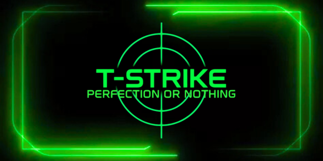

# T-Strike

T-Strike is a fast-paced, reaction-based web game where precision is everything. Your goal? Stop the timer exactly at a randomly generated target time (e.g., _5.00 seconds_). Simple? Yes. Easy? Not at all.

Developed using HTML, CSS, and vanilla JavaScript, this project showcases fundamental frontend development skills and is fully deployed via GitHub Pages.  
It was also originally created as part of a high school computer science project.

👉 [Play the game](https://leoleman555.github.io/T-Strike/)

## Table of Contents

- [Features](#features)
- [Contributing](#contributing)
- [License](#license)
- [Credits](#credits)
- [Contact](#contact)

## Features

### Gameplay

- A random target time is displayed at the start of each round.
- Press Start (or Spacebar) to begin the timer.
- Press again to stop as close to the target as possible.
- Scoring is based on accuracy, with custom feedback messages (_Perfect_, _Good job_, _Missed_, etc.).
- Difficulty increases as you improve:
  - Faster timer
  - Tighter error margins
  - Visual distractions

### Tech Stack

- **HTML**: Page structure
- **CSS**: Styling, animations, theming
- **JavaScript**: Game logic, event handling
- **GitHub Pages**: Free static hosting

## Contributing

Contributions are welcome! If you have suggestions for new features or improvements, feel free to open an issue or submit a pull request.

If you like the project, consider giving it a ⭐️ on GitHub — it really helps!

## License

This project is licensed under the MIT License. See the [LICENSE](LICENSE) file for more details.

## Credits

Developed by [Léo Leman](https://github.com/LeoLeman555) and created as part of a high school CS course to demonstrate frontend proficiency and creative thinking.

## Contact

For questions or feedback:

- GitHub: **[LeoLeman555](https://github.com/LeoLeman555)**
- Email: **leo.leman555@gmail.com**
